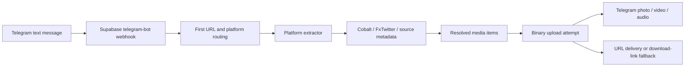

<div align="center" dir="rtl">

# PIMX SAVE BOT

**یک لینک بفرست؛ فایل یا لینک دانلود دریافت کن.**

**[باز کردن @PIMX_SAVE_BOT ↗](https://t.me/PIMX_SAVE_BOT)**

[English](README.md) · [فارسی](README.fa.md) · [کد پروژه](https://github.com/MOHAMMADREZAABEDINPOOR/PIMX_SAVE_BOT)

</div>

PIMX SAVE BOT یک ربات تلگرام با TypeScript است که روی Deno و Supabase Edge Functions اجرا می‌شود. با دریافت لینک عمومی رسانه، تلاش می‌کند فایل را استخراج کند، به گفت‌وگو بفرستد و دکمه‌های دانلود مستقیم و منبع را نمایش دهد.

نام رسمی پروژه **PIMX_SAVE_BOT** و نام کاربری تلگرام **@PIMX_SAVE_BOT** است. این همان نسخهٔ جدید TypeScript است که قبلاً با نام `PIMX_SONIC_BOT_V2` منتشر شده بود؛ تاریخچهٔ مخزن حفظ شده است.

## استفاده از ربات

1. [@PIMX_SAVE_BOT](https://t.me/PIMX_SAVE_BOT) را در تلگرام باز کن.
2. دستور `/start` یا `/help` را بفرست.
3. لینک عمومی رسانه را به‌صورت پیام متنی ارسال کن.
4. اگر ارسال موفق باشد، تصویر، ویدئو یا صوت دریافت می‌کنی. در صورت شکست ارسال داخل گفت‌وگو، از لینک دانلود ارائه‌شده استفاده کن.

پردازشگر فعلی فقط **اولین لینک هر پیام متنی** را بررسی می‌کند. کپشن فایل‌ها پردازش نمی‌شود و دستور مستقلی برای تبدیل لینک به صوت وجود ندارد.

## مسیرهای استخراج موجود در کد

این جدول رفتار پیاده‌سازی را توضیح می‌دهد؛ موفقیت همهٔ پست‌ها یا دسترس‌پذیری دائمی سرویس‌ها را تضمین نمی‌کند.

| منبع | پیاده‌سازی | نکته |
|---|---|---|
| YouTube | درخواست ویدئو یا صوت از Cobalt | کیفیت پیش‌فرض درخواستی 1080p و کدک H.264 است؛ نتیجه به سرویس استخراج بستگی دارد. |
| Instagram | Cobalt و پاسخ‌های چندفایلی picker | آیتم‌های کاروسل جداگانه ارسال می‌شوند؛ پارامترهای پرس‌وجوی لینک پیش از استخراج حذف می‌شوند. |
| X / Twitter | اطلاعات FxTwitter، سپس مسیر جایگزین Cobalt | ویدئوی دارای بیشترین بیت‌ریت گزارش‌شده انتخاب می‌شود؛ در نبود ویدئو، تصاویر بررسی می‌شوند. |
| SoundCloud | حالت صوتی Cobalt | در صورت استخراج موفق، خروجی MP3 درخواست می‌شود. |
| Spotify | اطلاعات آهنگ، جست‌وجوی YouTube و سپس Cobalt | فایل اصلی Spotify دانلود نمی‌شود؛ اولین نتیجهٔ YouTube استفاده می‌شود و پیش‌نمایش Spotify مسیر جایگزین است. |
| لینک‌های دیگر | درخواست عمومی Cobalt | به پشتیبانی همان نمونهٔ Cobalt بستگی دارد؛ پلتفرم‌های دیگر تضمین‌شده نیستند. |

بخش اطلاعات Spotify انتظار لینک `open.spotify.com/track/...` را دارد. لینک آلبوم، پلی‌لیست، لینک کوتاه، محتوای خصوصی، حذف‌شده یا محدود ممکن است نتیجه ندهد.

## معماری



ربات مستقیماً از HTTP Bot API تلگرام استفاده می‌کند. در این کد، فریم‌ورک ربات، دیتابیس برنامه، آرشیو دائمی دانلود، صف پردازش یا رابط وب مستقلی وجود ندارد.

## ساختار پروژه

```text
supabase/
  config.toml
  functions/telegram-bot/
    index.ts                  # دریافت درخواست، دستورها و جریان پردازش
    telegram.ts               # ارسال فایل و مسیرهای جایگزین تلگرام
    types.ts                  # نوع دادهٔ پیام‌ها و رسانه‌ها
    deno.json                 # وابستگی‌های زمان اجرا
    extractors/
      index.ts                # انتخاب استخراج‌کننده
      youtube.ts
      instagram.ts
      twitter.ts
      soundcloud.ts
      spotify.ts
    utils/
      cobalt.ts               # انتخاب سرویس و زمان انتظار درخواست
      helpers.ts              # تشخیص لینک و قالب‌بندی اطلاعات
```

## تنظیمات

| متغیر | ضرورت | کاربرد |
|---|---|---|
| `TELEGRAM_BOT_TOKEN` | برای پردازش POST لازم است | توکن BotFather رباتی که مدیریت می‌کنی. |
| `COBALT_API_URL` | اختیاری | آدرس نمونهٔ ترجیحی Cobalt که پیش از دو نمونهٔ جایگزین داخل `utils/cobalt.ts` امتحان می‌شود. |

فایل نادیده‌گرفته‌شدهٔ `.env.local` را با مقادیر خودت بساز:

```dotenv
TELEGRAM_BOT_TOKEN=REPLACE_WITH_YOUR_BOTFATHER_TOKEN
# اختیاری: آدرس نمونه‌ای که در اختیار داری یا به آن دسترسی داری.
# COBALT_API_URL=https://your-cobalt-instance.example/
```

درخواست Cobalt به‌صورت JSON و بدون هدر کلید API ارسال می‌شود. دسترسی، سازگاری و محدودیت درخواست به نمونهٔ انتخابی بستگی دارد. توکن تلگرام را در فایل محیطی محلی یا Secrets سوپابیس نگه دار؛ آن را داخل README یا کامیت قرار نده. [راهنمای متغیرهای محیطی Supabase](https://supabase.com/docs/guides/functions/secrets).

## اجرای محلی

[Supabase CLI](https://supabase.com/docs/guides/local-development/cli/getting-started) و Docker را برای محیط محلی نصب کن. از ریشهٔ مخزن اجرا کن:

```sh
supabase start
supabase functions serve telegram-bot --env-file .env.local --no-verify-jwt
```

آدرس محلی تابع `http://127.0.0.1:54321/functions/v1/telegram-bot` است. درخواست GET، نام ربات و زمان را در JSON برمی‌گرداند. این پاسخ صحت توکن، ثبت وب‌هوک، دسترس‌پذیری استخراج‌کننده‌ها یا ارسال موفق فایل را بررسی نمی‌کند.

اگر توکن واقعی تنظیم شده باشد، درخواست POST می‌تواند پیام واقعی ارسال کند. برای توسعه از ربات و گفت‌وگوی آزمایشی خودت استفاده کن.

## دیپلوی نمونهٔ خودت

نام تابع همچنان `telegram-bot` است؛ تغییر نام مخزن، آدرس تابع Supabase را عوض نمی‌کند. از پروژه و دسترسی‌های خودت استفاده کن:

```sh
supabase login
supabase link --project-ref YOUR_PROJECT_REF
supabase secrets set --env-file .env.local
supabase functions deploy telegram-bot --no-verify-jwt
```

قالب آدرس `https://YOUR_PROJECT_REF.supabase.co/functions/v1/telegram-bot` است. تنظیم موجود `verify_jwt = false` است، چون تلگرام JWT کاربر Supabase را همراه وب‌هوک ارسال نمی‌کند. [راهنمای دیپلوی](https://supabase.com/docs/guides/functions/deploy)، [تنظیمات تابع](https://supabase.com/docs/guides/functions/function-configuration).

آدرس HTTPS را با متد `setWebhook` تلگرام ثبت کن. نمونهٔ PowerShell زیر فرض می‌کند توکن خودت از قبل در متغیر محیطی قرار دارد:

```powershell
$botApi = 'https://api.telegram.org/bot' + $env:TELEGRAM_BOT_TOKEN
Invoke-RestMethod -Method Post -Uri ($botApi + '/setWebhook') -Body @{
  url = 'https://YOUR_PROJECT_REF.supabase.co/functions/v1/telegram-bot'
  allowed_updates = '["message"]'
}
Invoke-RestMethod -Uri ($botApi + '/getWebhookInfo')
```

این دستورها وب‌هوک همان رباتی را تغییر می‌دهند که توکنش را وارد کرده‌ای. هر ربات فقط یک وب‌هوک فعال دارد. پردازشگر فعلی هدر `X-Telegram-Bot-Api-Secret-Token` را اعتبارسنجی نمی‌کند؛ تعیین `secret_token` در تلگرام به‌تنهایی این قابلیت را به کد اضافه نمی‌کند. [مستندات وب‌هوک تلگرام](https://core.telegram.org/bots/api#setwebhook).

## محدودیت‌ها و رفتار اجرایی

- کد فقط برای فایل‌هایی با حجم گزارش‌شده و دریافت‌شدهٔ حداکثر **50 MiB** تلاش به آپلود مستقیم می‌کند. تلگرام محدودیت‌های مخصوص هر نوع رسانه را دارد و ممکن است فایل کوچک‌تر هم رد شود. وجود لینک جایگزین، به معنای حجم نامحدود یا لینک دائمی نیست.
- استخراج به سرویس‌های بیرونی و محتوای عمومی منبع وابسته است. لینک مستقیم ممکن است منقضی شود یا به دسترسی‌ای نیاز داشته باشد که تلگرام ندارد.
- استخراج و ارسال داخل همان درخواست انجام می‌شود. صف پایدار، حذف پیام‌های تکراری بر اساس update ID، سهمیهٔ کاربر و پردازشگر تلاش مجدد وجود ندارد.
- بخش مدیریت خطا پاسخ HTTP 200 می‌دهد؛ بنابراین درخواست تأییدشده ممکن است در داخل شکست خورده باشد. لاگ تابع و `getWebhookInfo` را همراه رفتار واقعی ربات بررسی کن.
- لینک و درخواست رسانه به تلگرام، پلتفرم منبع و سرویس استخراج ارسال می‌شود. کد تاریخچهٔ برنامه‌ای نگه نمی‌دارد، اما این درخواست‌های بیرونی خصوصی محسوب نمی‌شوند.

## رفع اشکال

| نشانه | بررسی |
|---|---|
| GET پاسخ می‌دهد اما ربات جواب نمی‌دهد | Secret توکن و آدرس وب‌هوک را بررسی کن؛ GET صحت آن‌ها را نمی‌سنجد. |
| پیش از ورود به کد، HTTP 401 دریافت می‌شود | تنظیم JWT تابع دیپلوی‌شده را بررسی کن. |
| استخراج شکست می‌خورد | لینک عمومی، نمونهٔ Cobalt و لاگ تابع را بررسی کن. |
| Spotify نسخهٔ دیگری از آهنگ یا فقط پیش‌نمایش می‌دهد | کد از نتیجهٔ جست‌وجوی YouTube و سپس پیش‌نمایش استفاده می‌کند. |
| فقط یکی از چند لینک پردازش می‌شود | پردازشگر فعلی فقط `urls[0]` را انتخاب می‌کند. |
| به‌جای فایل، دکمهٔ دانلود نمایش داده می‌شود | حجم فایل، رد شدن ارسال در تلگرام، خطای دریافت یا ناسازگاری رسانه می‌تواند علت باشد. |

این مستندات در **2026-10-08** با کد مخزن تطبیق داده شد. این بازنویسی ادعای آزمون سرتاسری دانلود همهٔ پلتفرم‌ها را ندارد.
