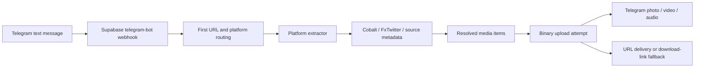

<div align="center">

# PIMX SAVE BOT

**A media link in. A file or download link out.**

**[Open @PIMX_SAVE_BOT ↗](https://t.me/PIMX_SAVE_BOT)**

[English](README.md) · [فارسی](README.fa.md) · [Source](https://github.com/MOHAMMADREZAABEDINPOOR/PIMX_SAVE_BOT)

</div>

PIMX SAVE BOT is a TypeScript Telegram media bot that runs as a Supabase Edge Function on Deno. Send a public media URL, and it attempts to resolve the media, deliver it to your chat, and include direct-download and source buttons.

The canonical project name is **PIMX_SAVE_BOT** and the Telegram username is **@PIMX_SAVE_BOT**. This is the latest TypeScript version previously published under `PIMX_SONIC_BOT_V2`; the repository history is retained.

## Use the bot

1. Open [@PIMX_SAVE_BOT](https://t.me/PIMX_SAVE_BOT) in Telegram.
2. Send `/start` or `/help`.
3. Paste a public media link as a text message.
4. Receive the resolved photo, video, or audio when delivery succeeds. If in-chat delivery fails, use the download link the bot provides.

The current handler processes **the first URL in each text message**. It does not process attachment captions or expose a separate audio-only command.

## Extraction paths in the code

These are implemented paths, not a guarantee that every post or upstream service will remain available.

| Source | Implementation | Important detail |
|---|---|---|
| YouTube | Cobalt request for video or audio | Requests 1080p/H.264 by default; the upstream service determines the actual result. |
| Instagram | Cobalt, including picker responses | Multiple carousel items are sent separately; query parameters are removed before extraction. |
| X / Twitter | FxTwitter metadata, then Cobalt fallback | Chooses the highest reported video bitrate; photos are used when no video was resolved. |
| SoundCloud | Cobalt in audio mode | Requests MP3 output when the extractor can resolve the track. |
| Spotify | Track metadata, YouTube search, then Cobalt | This does **not** download the original Spotify stream. It uses the first YouTube match, with a Spotify preview fallback when available. |
| Other URLs | Generic Cobalt request | Depends on the selected Cobalt instance; additional platforms are not guaranteed. |

Spotify metadata parsing expects an `open.spotify.com/track/...` URL. Album, playlist, short-link, private, removed, or restricted content may fail.

## How it works



The bot uses Telegram's HTTP Bot API directly. There is no bot framework, application database, persistent download archive, job queue, or separate web frontend in this source tree.

## Project layout

```text
supabase/
  config.toml
  functions/telegram-bot/
    index.ts                  # HTTP handler, commands, extraction and delivery
    telegram.ts               # Telegram methods and upload/link fallbacks
    types.ts                  # Telegram updates and media result types
    deno.json                 # Runtime imports
    extractors/
      index.ts                # Platform router
      youtube.ts
      instagram.ts
      twitter.ts
      soundcloud.ts
      spotify.ts
    utils/
      cobalt.ts               # Instance selection and request timeouts
      helpers.ts              # URL detection and text/metadata formatting
```

## Configuration

| Variable | Required | Purpose |
|---|---|---|
| `TELEGRAM_BOT_TOKEN` | Yes for POST processing | BotFather token for the bot you operate. |
| `COBALT_API_URL` | No | Preferred Cobalt endpoint, tried before the two fallback instances hardcoded in `utils/cobalt.ts`. |

Create an ignored `.env.local` file with your own values:

```dotenv
TELEGRAM_BOT_TOKEN=REPLACE_WITH_YOUR_BOTFATHER_TOKEN
# Optional: use a Cobalt endpoint you operate or can access.
# COBALT_API_URL=https://your-cobalt-instance.example/
```

The Cobalt client sends JSON without a provider API-key header. Endpoint availability, compatibility, rate limits, and permissions depend on the instance you choose. Telegram credentials belong in local environment files or Supabase secrets, never in README examples or Git commits. [Supabase environment-variable guide](https://supabase.com/docs/guides/functions/secrets).

## Run locally

Install the [Supabase CLI](https://supabase.com/docs/guides/local-development/cli/getting-started) and Docker for its local stack. From the repository root:

```sh
supabase start
supabase functions serve telegram-bot --env-file .env.local --no-verify-jwt
```

The local function URL is `http://127.0.0.1:54321/functions/v1/telegram-bot`. A GET request returns JSON with the bot name and timestamp. That health response does **not** verify the bot token, webhook registration, extraction providers, or successful media delivery.

POST updates can trigger real messages when a real bot token is configured. Use your own test bot and chat for development.

## Deploy your own instance

The checked-in function name remains `telegram-bot`; the repository rename does not change the Supabase endpoint. Use your own Supabase project and credentials:

```sh
supabase login
supabase link --project-ref YOUR_PROJECT_REF
supabase secrets set --env-file .env.local
supabase functions deploy telegram-bot --no-verify-jwt
```

The endpoint format is `https://YOUR_PROJECT_REF.supabase.co/functions/v1/telegram-bot`. The checked-in configuration has `verify_jwt = false`, because Telegram webhook requests do not contain a Supabase user JWT. [Supabase deployment guide](https://supabase.com/docs/guides/functions/deploy), [function configuration](https://supabase.com/docs/guides/functions/function-configuration).

Register that HTTPS URL through Telegram's `setWebhook` method. For example, in PowerShell with your token already available in the environment:

```powershell
$botApi = 'https://api.telegram.org/bot' + $env:TELEGRAM_BOT_TOKEN
Invoke-RestMethod -Method Post -Uri ($botApi + '/setWebhook') -Body @{
  url = 'https://YOUR_PROJECT_REF.supabase.co/functions/v1/telegram-bot'
  allowed_updates = '["message"]'
}
Invoke-RestMethod -Uri ($botApi + '/getWebhookInfo')
```

These commands change the webhook of the bot whose token you supply. Telegram allows one active webhook per bot. The current handler does **not** validate the `X-Telegram-Bot-Api-Secret-Token` header; setting Telegram's optional `secret_token` alone will not add that validation. [Telegram webhook API](https://core.telegram.org/bots/api#setwebhook).

## Delivery limits and operational behavior

- The code attempts a binary upload only when the reported and downloaded size is at most **50 MiB**. Telegram applies its own media-specific limits and may reject smaller files too. A link fallback is not a promise of unlimited file size or permanent availability.
- Extraction depends on third-party services and public source content. Direct URLs can expire or require upstream access that Telegram does not have.
- Requests process extraction and delivery synchronously. There is no persistent queue, update-ID deduplication, per-user quota, or automatic retry worker.
- The error catch returns HTTP 200, so an acknowledged update can still have failed internally. Check function logs and `getWebhookInfo` alongside actual bot behavior.
- Links and media requests are sent to Telegram, source platforms, and extraction services. The implementation does not retain an application-level history, but it does not make those external requests private.

## Troubleshooting

| Symptom | Check |
|---|---|
| GET health works, but the bot does not respond | Confirm the token secret and the webhook URL; health does not validate either. |
| HTTP 401 before the handler | Check the deployed function's JWT verification configuration. |
| Extraction fails | Try a public post and inspect the configured Cobalt instance and function logs. |
| Spotify returns a different recording or only a preview | The code uses a YouTube search match, then a preview fallback. |
| Only one of several pasted links is processed | The handler intentionally selects `urls[0]`. |
| A download button appears instead of a file | Upload size, Telegram rejection, source fetching, or media compatibility can cause this fallback. |

Documentation checked against this repository's source on **2026-10-08**. End-to-end delivery across all platforms has not been asserted by this documentation update.
