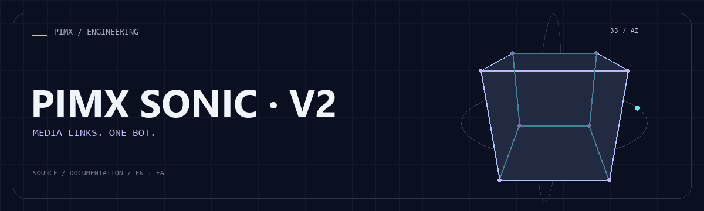

<div align="center">



**[English](README.md) · [فارسی](README.fa.md)**


</div>

# PIMX SONIC · V2

A TypeScript/Deno Telegram media bot deployed as a Supabase Edge Function. Platform extractors handle YouTube, Instagram, X, SoundCloud and Spotify links.

[GitHub](https://github.com/MOHAMMADREZAABEDINPOOR/PIMX_SONIC_BOT_V2) · [PIMX / Profile](https://github.com/MOHAMMADREZAABEDINPOOR) · [Static artwork](assets/readme/hero.png)

## Features

- Platform-specific extractors and a shared routing layer
- Telegram media delivery with direct-link fallback
- Cobalt fallback helpers and Spotify metadata resolution
- Serverless webhook and GET health endpoint

## Stack

| Tool | Version / source |
|---|---|
| TypeScript / Deno | `Supabase Edge Runtime` |
| Telegram | `Bot API` |

## Getting started

Node.js for the Supabase CLI, a Supabase project and a Telegram bot token. Deno is useful for checking Edge code.

```bash
git clone https://github.com/MOHAMMADREZAABEDINPOOR/PIMX_SONIC_BOT_V2.git
cd PIMX_SONIC_BOT_V2

npx supabase login
npx supabase link --project-ref YOUR_PROJECT_REF
# Create supabase/secrets.local.env with TELEGRAM_BOT_TOKEN (never commit it)
npx supabase secrets set --env-file supabase/secrets.local.env
npx supabase functions deploy telegram-bot --no-verify-jwt
```

## Configuration

These names are found in the example configuration or source; not all are required. Check their defaults/usage in those files and supply secrets only in your local or hosting environment.

| Name | Role |
|---|---|
| `COBALT_API_URL` | Application setting; inspect its definition |
| `TELEGRAM_BOT_TOKEN` | Credential/connection setting; keep private |

## Usage

Link your own Supabase project, set TELEGRAM_BOT_TOKEN as an Edge Function secret and deploy telegram-bot. Register its HTTPS function URL with Telegram setWebhook, then send a supported media link.

## Project structure

| Path | Role |
|---|---|
| [`assets/`](assets/) | Brand/media/README assets |
| [`supabase/`](supabase/) | Edge function source/configuration |

## Commands and checks

No automated test command is declared in a manifest. Verify behavior through a local example run.

## Deployment

The setup commands deploy the Edge Function. Register your own function URL with the Telegram `setWebhook` API. Keep secrets.local.env and supabase/.temp/ out of Git.

## Limitations

Telegram upload limits, provider availability and Edge runtime limits still apply. A direct download link is not unlimited Telegram delivery. Spotify can fall back to metadata/preview. JWT verification is disabled for Telegram webhooks; add webhook authentication before public production use.

## Troubleshooting

- Authentication/provider errors: verify credentials and selected model/provider.
- No Telegram updates: check polling/webhook mode and concurrent bot instances.
- Missing dependencies: use the declared manifest or inspect imports if no manifest is provided.

## Contributing

Create a focused branch, verify the affected behavior and explain the change clearly. Keep private data, build outputs and local databases out of commits.

## License

No repository-level license file is included in this snapshot. Public visibility alone does not grant reuse rights; contact the repository owner for terms.

---

Part of **PIMX** · Documentation in English and Persian.
